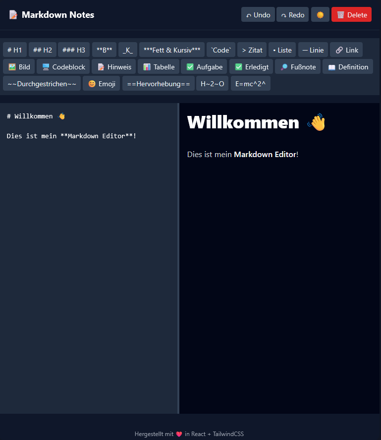
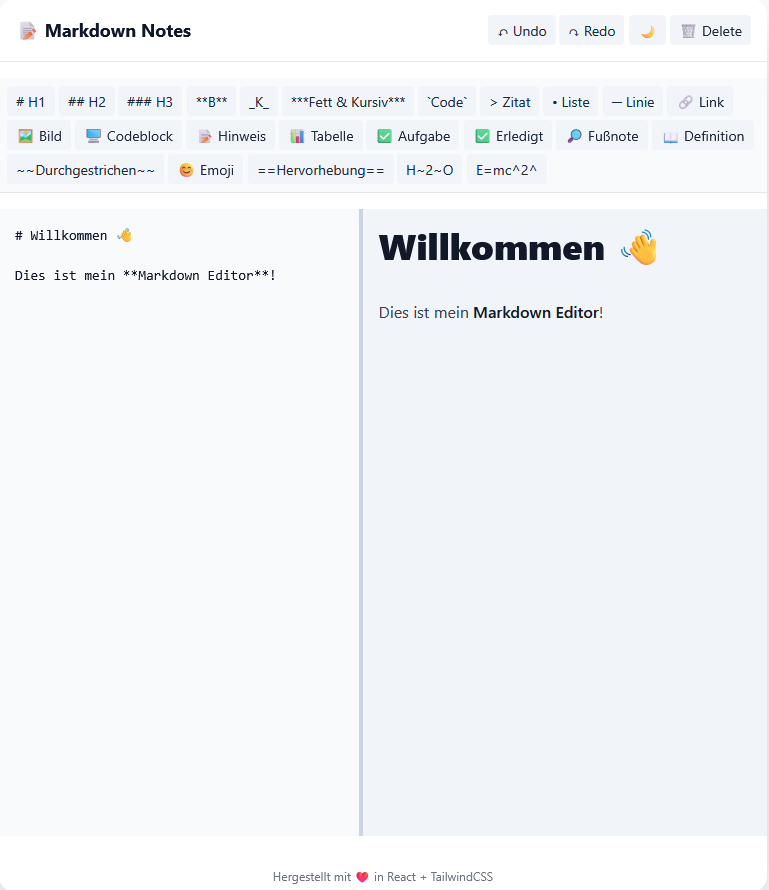

# 📝 Markdown Editor

Ein moderner, schneller und minimaler **Markdown-Editor** mit Live-Vorschau, gebaut mit  
⚛️ **React**, ⚡ **Vite** und 🎨 **TailwindCSS**.

---

## 🚀 Features

- **Live Markdown Preview** (mit [`react-markdown`](https://github.com/remarkjs/react-markdown))
- **Autosave** in LocalStorage
- **Dark / Light Mode**
- **Toolbar** mit Formatierungsbuttons (Bold, Italic, Code, Quote, List, Divider)
- **Responsive Two-Column Layout**
- **Instant Hot Reloading (HMR)** dank Vite
- **Markdown-Syntax via GFM** (GitHub-Flavored Markdown)
- **Clean UI** mit TailwindCSS + Typography Plugin

---

## 🖼️ Vorschau

| Dark Mode                                  | Light Mode                                   |
| ------------------------------------------ | -------------------------------------------- |
|  |  |

## 🧰 Tech Stack

| Technologie                                                  | Beschreibung                     |
| ------------------------------------------------------------ | -------------------------------- |
| [React](https://react.dev/)                                  | UI-Bibliothek                    |
| [Vite](https://vitejs.dev/)                                  | Dev-Server & Bundler             |
| [TailwindCSS](https://tailwindcss.com/)                      | Utility-First CSS Framework      |
| [React Markdown](https://github.com/remarkjs/react-markdown) | Markdown-Rendering               |
| [remark-gfm](https://github.com/remarkjs/remark-gfm)         | GitHub-Flavored Markdown Support |
| [Framer Motion](https://www.framer.com/motion/)              | Animationen (optional)           |

---

## ⚙️ Installation & Setup

### Projekt klonen oder erstellen

git clone https://renor-711.github.io/markdown-editor/

```bash
# Neues Projekt erstellen
npm create vite@latest markdown-editor -- --template react-ts
cd markdown-editor
---
## 💡 Verwendung

Links im Editor schreiben → rechts sofortige Vorschau

Formatierung über Toolbar (B, I, Code, Quote, etc.)

Dark Mode mit ☀️ / 🌙 umschalten

Inhalt wird automatisch gespeichert
---
## 🧑‍💻 Autor

Name: Renumol Reinhardt
📧 renu711@hotmail.de
🌐 https://renor-711.github.io/Portfolio-Website/
---
🪪 Lizenz

MIT License © 2025
Du darfst diesen Code frei verwenden, verändern und verteilen.